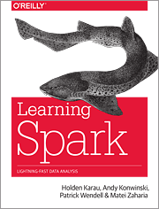

title: "Introduction to Big Data with Spark and Python"
author:
    name: Dan Koch
    url: https://github.com/dmkoch/spark-intro
    twitter: dkoch
theme: sudodoki/reveal-cleaver-theme
output: presentation.html

--

## Introduction to Big Data with Spark and Python
### CharPy meetup June 18, 2015

--

## What is big data?

> Big data is a broad term for data sets so large or complex
> that traditional data processing applications are inadequate
> *-- Wikipedia*

--

## Characteristics

* Volume
  * One machine can hold how many Gigabytes, Terabytes, Petabytes?
  * 3 hours to read 1 TB from a hard drive
* Velocity -- Writes come in faster than even the largest machine can handle
* Also Variety, Variability, Veracity, Complexity *-- Wikipedia*

--

## Why Spark

* General-purpose cluster computing framework
* Wide variety of applications supported
* High and low-level APIs "everything included"
* Fast -- designed to run in memory

--

## Language APIs

* Scala
* Java
* Python 2
* Python 3 (Spark 1.4)
* R (Spark 1.4)
* Others with pipe()

--

## Components

* Spark Streaming
* MLlib
* GraphX
* DataFrames / SparkSQL
* SparkR

--

## Why Python

* Data science support
* General purpose -- you can build a web app too
* Readability

--

## Installation

    # Download tarball (https://spark.apache.org/downloads.html)
    tar xf spark.tar.gz
    export SPARK_HOME=/path/to/sparkdir
    export PYTHONPATH=$SPARK_HOME/python
    pip install py4j
    pyspark

--

## Programming Model

* RDD -- Resilient Distributed Dataset
    * Transformations
    * Actions
* Transparent Scaling -- Laptop to Cluster

--

## Development tools

* pyspark shell
* standalone scripts
* IPython Notebook

--

## Production

    spark-submit \
       --master spark://10.10.10.10:7077 \
       yourscript.py arg1 arg2

--

## Operations

* Cluster managers
    * Standalone
    * YARN
    * Mesos

* Commercial offerings
    * Mesosphere -- Enterprisey Mesos
    * Databricks -- Cluster Manager for AWS
    * Amazon EMR -- Packaging of Spark on Hadoop YARN

--

## Hello World
    wordcounts = sc.textFile(filename) \
        .map(lambda text: re.sub('[^a-z0-9 ]+', '', text.lower()).strip()) \
        .flatMap(lambda text: text.split()) \
        .map(lambda word: (word, 1)) \
        .reduceByKey(lambda x, y: x + y)  # Transformations

    print(wordcounts.takeOrdered(10, key=lambda (k, v): -v))  # Action

--

## Resources

* Official documentation [https://spark.apache.org/docs/latest/](https://spark.apache.org/docs/latest/)
* Berkeley EdX [Introduction to Big Data with Apache Spark](https://www.edx.org/course/introduction-big-data-apache-spark-uc-berkeleyx-cs100-1x)
* O'Reilly Learning Spark 

--

## [Tutorial](http://localhost:8001/notebooks/spark_tutorial_student.ipynb)

